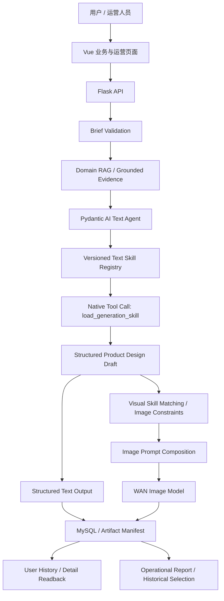

# 智能文创平台 · Smart Cultural Platform

> 一个面向文化创意场景的受控 AI Agent 应用平台，将领域 RAG、版本化 Skill Registry、模型工具调用、结构化生成、图片工作流、数据库持久化和 AI 评测整合为可观测、可审计的业务流程。

这不是一次性“调用大模型生成图片”的封装。项目把用户 Brief、文化资料检索、Grounded Evidence、Agent/Skill 选择、文本或图片生成、结果校验、数据库写入、历史记录和运营报告拆成明确的工程边界，并为每一步保留可验证证据。

适用场景包括博物馆文创、文化 IP 衍生品、数字展陈和文化内容创作。项目当前以本地文化语料、Flask/Vue 业务应用和 MySQL 在线日志为核心，重点展示受控 Agent 编排，而不是追求无限自主的智能体。

## 为什么是受控 Agent 应用

- **Agent Orchestration**：Pydantic AI 管理 Agent Loop、工具声明、调用预算和结构化结果；模型只能在服务端允许的工具与 Skill 集合内行动。
- **Domain RAG**：文化证据来自本地 Met Open Access 语料；来源 ID、证据状态与引用边界被保留，而不是把模型联想当历史事实。
- **Versioned Skills**：Skill 是有版本、许可证、来源和完整性校验的资产，不是任意文件或临时 prompt。
- **Structured Generation**：Brief、工具参数、最终输出、业务记录和报告都有 Pydantic/JSON 契约。
- **Observable Workflow**：工具轨迹、Skill ID/version/hash、RAG 来源、耗时、调用次数、失败阶段与稳定错误码进入 artifact 或业务日志。
- **Business Persistence**：成功的生产图片生成写入 MySQL `generation_logs`；用户只能读取自己的历史和详情。

## 统一业务架构

平台的目标是把用户创作和运营追踪放在同一条可审计流水线上：先由文本 Agent 基于文化证据和文本 Skill 形成可交付的产品设计稿，再把设计稿交给视觉约束与图片模型，最终将业务结果、证据和轨迹统一写入历史与运营报告。



这张图表达的是明确的目标编排：

1. **Text Skill 阶段**：模型在 text kind catalog 中自主选择一个合法文本 Skill，原生 `load_generation_skill` 调用由服务端安全 loader 执行；Brief、Grounded Evidence 与 Skill Instructions 共同形成产品文案和文字版产品设计稿。
2. **Visual / Image 阶段**：产品设计稿与文化 evidence、展示方式、材质和视觉约束组成图片 prompt；视觉 Skill 只在图片阶段用于匹配和约束视觉设计，再交由 WAN 图片模型生成产品图。
3. **业务与运营阶段**：文本、图片、来源、Skill、工具轨迹、耗时、调用次数和数据库记录进入用户历史与运营报告，支持回溯和问题定位。

能力边界保持不变：文本 Agent 只暴露 text Skill；visual/image Skill 不作为文本 Agent 的工具；文字版设计说明是产品设计交付的一部分，不等同于视觉模型调用。

仓库已经分别具备文本 Skill Agent 的原生工具调用/安全 loader 证据，以及生产 V2 的 Qwen + WAN 图片生成和 MySQL 持久化证据。当前生产图片入口使用经过校验的 `visual_direction`、展示要求和文化上下文构造图片工作流；将产品设计稿与 visual Skill 匹配串成同一次生产调用，是该统一架构的下一步接线目标。

## Agent 能力与工具调用

项目基于 **Pydantic AI** 编排受控 Agent Loop，覆盖：

- Agent Loop 与 Agent Orchestration；
- Function Calling / Tool Calling；
- 原生 `load_generation_skill` 工具调用；
- 服务端安全 loader 执行与返回回执；
- Pydantic 结构化输出与严格 Schema Validation；
- 工具轨迹、阶段耗时、`RunUsage.requests`/实际调用计数记录；
- 请求数、工具数、重复 Skill 和不合法来源的限制。

在 Round 17C 的真实文本业务证据中，Qwen 已产生原生 `load_generation_skill` 调用并实际加载文本 Skill；这证明的是工具调用与安全加载链路，不等同于“Skill 已被统计证明提升质量”。

## Versioned Skill Registry

固定 Registry 位于 [`backend/agents/skill_registry.py`](backend/agents/skill_registry.py)，当前包含 3 个 text Skill 和 3 个 visual Skill。每个正式 `SKILL.md` 使用一致的 metadata：

```text
name / kind / version / description / license / source_urls
```

Registry 与文件资产同时校验，安全 loader 会检查：

- 固定 name、kind、version、description、license、source URLs 是否一致；
- UTF-8 解码、frontmatter 格式与非空正文；
- NUL、超长内容、非法/缺失 metadata 和 metadata drift；
- 路径穿越、符号链接逃逸、缺失文件与任意文件加载；
- Skill 正文 SHA-256 与被加载资产的对应关系。

任何不一致均以稳定的 `SKILL_ASSET_INVALID`、`UNKNOWN_SKILL` 等错误边界失败。模型只可提交 Registry 中允许的 Skill ID，不能传文件路径、Shell 指令或任意 URL。

## Prompt Engineering 与上下文边界

生成链路采用 **Prompt Engineering**、**Prompt Versioning**、**Context Management** 和 **Structured Prompt Composition**：

1. System Prompt 定义工具、事实和输出边界；
2. User Brief 提供产品、文化来源、场景、材质和展示要求；
3. RAG Evidence 作为受控文化事实输入；
4. 实际加载的 Skill Instructions 作为受信任写作/设计约束；
5. Final Output Schema 约束最终机器可读交付；
6. planner/tool 轨迹与最终面向用户的文本严格隔离。

Skill 不能改写最终公共 Schema；内部字段标签、JSON 壳、source ID、Skill 名称和工具理由不能泄漏到最终产品文案。Round 17C 的最终输出契约会拒绝嵌套 JSON 字符串和内部分析格式。

## Domain RAG 与 Grounded Generation

文化资料检索基于 [`rag/corpus/met_open_access`](rag/corpus/met_open_access) 的本地语料，由 [`backend/rag`](backend/rag) 提供检索服务。项目使用 BM25/jieba 等本地检索能力，并把每次命中的来源限制为可追溯 evidence：

- source IDs 与来源链接；
- frozen evidence 与完整性 hash（受控文本评测路径）；
- `grounded` / `insufficient_evidence` 等证据状态；
- citation 必须是检索证据的非空子集；
- 没有合法证据时，受控文本路径会在模型调用前阻止生成。

> 将文化资料检索结果作为受控 evidence 注入 Agent 和生成链路，避免把模型自由联想当作历史事实。

生产图片路径也保存其实际使用的证据状态和来源，便于用户历史与详情回看。

## Structured Output 与 Guardrails

项目的 Guardrails 面向 Agent 工具、资产、输出、权限和持久化边界：

- Pydantic Brief/输出 Schema 与字段长度、类型、展示方式校验；
- JSON/内部字段泄漏与无效 final-output contract 拒绝；
- Skill 白名单、kind 分离、工具数量与调用顺序限制；
- Agent 不可访问任意 Shell、SQL、路径、网络、凭据或未注册工具；
- 文化来源、引用和 grounded 状态校验；
- 生产图片生成仅在全部前置步骤成功后进入数据库事务；
- 受控文本业务使用 `run_id` 幂等与 sealed artifact；生产 V2 图片路径记录 request/生成阶段；
- owner-only history/detail readback；
- 未通过校验的 artifact 在报告 API 中 fail closed；
- 面向客户端和 artifact 的稳定错误码、失败阶段和脱敏诊断。

这是一组工程化防护，不把它夸大为完整 Prompt Injection 研究；相关安全边界由 Agent、Skill 和 Promptfoo security 测试覆盖。

## 生产业务能力与页面入口

| 场景 | 真实入口 | 说明 |
| --- | --- | --- |
| 登录 | `POST /api/login`、`/login.html` | JWT 登录后进入普通用户或运营页面。 |
| 普通图片生成 | `POST /api/v2/cultural-products/generate`、`/index.html` | 支持文化创意 Brief、单品/三视图要求、Qwen 文本、WAN 图片、MySQL 写入。 |
| 文本 Skill 实验生成 | `POST /api/v2/cultural-products/generate-with-text-skill` | 受控 text-only Agent 路径；不调用图片模型。 |
| 用户资料与记录 | `GET /api/user/profile`、`GET /api/user/history` | owner-only 图片记录、文本 Skill 记录和详情 readback。 |
| 运营报告 | `/dashboard.html`、`/api/dashboard/business-generation-reports` | 选择已封存的业务生成报告，展示证据、工具轨迹和运行信息。 |

普通用户图片业务具备：完整 Brief、三视图条件字段、真实文本/图片生成、WAN 图片模型、MySQL `generation_logs` 持久化、用户历史卡片和详情 readback。文本 Skill 记录以无图片的文本卡片显示，不伪造图片。

已封存的真实演示证据覆盖：普通用户业务提交、grounded RAG、Qwen 文本生成、WAN 图片生成、MySQL 持久化、用户历史、详情页和连续 Playwright 录像。文本 Skill 演示覆盖原生 Qwen tool call、安全 loader 和最终文本交付。

## AI Evaluation Pipeline

```text
Offline Contract Tests
        ↓
Promptfoo Agent / Stub / Security
        ↓
Controlled Real A/B Run
        ↓
Qwen Generation
        ↓
DeepSeek LLM-as-a-Judge
        ↓
AB / BA Pairwise
        ↓
Position Bias Analysis
        ↓
Normalized Report / HTML / SHA Seal
```

[`evaluation/promptfoo`](evaluation/promptfoo) 提供 Promptfoo Agent、Stub、Security 和失败退出码验证；Round 17C 还包括 MockTransport request-shape 测试、冻结 evidence、四个 Judge job、八维 rubric、AB/BA 匿名候选映射、位置偏差分析、严格 Judge parser、manifest 与 SHA-256 seal。

评测边界必须保持明确：

- DeepSeek Judge 是独立评测基础设施，当前生产业务页面不依赖它；
- Judge 输出只有通过严格 Schema、索引/候选 ID/理由一致性检查后才可用于比较；
- `judge_parse_error`、`judge_inconsistent`、`inconclusive_position_bias` 和其他 inconclusive 状态不会被包装成 Guided 获胜；
- 历史真实 A/B 已验证 Qwen 生成和 native Skill loading，但其不完整 Judge 结果不是正式质量结论；
- 当前业务演示重点是生成工作流和可审计业务结果，不宣称 Skill 质量已被统计证明。

## Observability 与 Auditability

项目将 **Agent Trace**、**Observability**、**Auditability**、**Reproducible Artifact** 和 **Failure-safe Evaluation** 落到具体字段和文件：

- request/run ID、Brief hash、冻结 evidence hash；
- planner/final latency、模型调用次数、retries；
- tool trajectory、Skill ID/version/body SHA-256；
- RAG source IDs、grounded 状态、数据库业务记录 ID；
- failure stage、stable error、脱敏 provider diagnostics；
- artifact manifest、required inventory、HTML/normalized report、SHA-256 seal；
- owner-only 用户历史 readback 与运营报告选择器。

`generation_logs` 是在线生成日志的事实来源；受控评测 artifact 与业务数据库各自承担不同的审计职责。

## 技术栈

| 层级 | 已使用组件 |
| --- | --- |
| 前端 | Vue 3、Vite、Axios、Chart.js、Playwright |
| 后端 | Python、Flask、Pydantic、PyMySQL、SQLAlchemy、Alembic |
| Agent / 模型 | Pydantic AI、OpenAI-compatible APIs、DashScope/Qwen、WAN image model |
| RAG | 本地 Met Open Access 语料、BM25、rank-bm25、jieba、来源约束 |
| 评测 | Pytest、Promptfoo、MockTransport、DeepSeek LLM-as-a-Judge（独立评测层） |
| 数据 | MySQL、Hive、HDFS、PyHive、PySpark、Pandas |
| 部署与运维 | systemd user services、Vercel static frontend deployment |

## 演示入口

### 普通用户真实图片生成

[](docs/demo/smart-cultural-platform-user-image-demo.webm)


演示展示普通用户的真实业务提交、RAG、Qwen 文本生成、WAN 图片生成、MySQL 事务写入、创作记录与详情回看。该生产图片链路不接入 Round 17C text Skill Agent，DeepSeek Judge 调用为 0。

### 文本 Skill Agent 演示

[](docs/demo/smart-cultural-platform-demo-1440p.webm)

演示展示冻结文化 evidence、Pydantic AI native `load_generation_skill`、安全文本 Skill 加载、结构化文本生成和运营业务报告。该路径不调用图片模型；Judge 结论保持独立且未完成状态。

### 运行地址

- Ubuntu 本地前端：`http://192.168.48.133:3000/index.html`
- Ubuntu 本地运营页：`http://192.168.48.133:3000/dashboard.html`
- 本地后端健康检查：`http://192.168.48.133:5000/api/health`
- Vercel 静态前端：<https://smart-cultural-platform-frontend.vercel.app>

Vercel 当前只托管前端静态页；动态登录、生成、数据库和私网 API 仍运行在 Ubuntu VM。访问真实动态业务需要可访问的后端环境，项目没有把私网 `192.168.48.133` 配置成 Vercel production rewrite。

## 本地启动

```bash
# 后端
cd /home/lily/桌面/smart-cultural-platform
source backend/.venv/bin/activate
PYTHONPATH=. python backend/app.py

# 前端（另一个终端）
cd /home/lily/桌面/smart-cultural-platform/frontend
npm ci
npm run dev -- --host 0.0.0.0 --port 3000 --strictPort
```

也可使用用户级 systemd 服务：

```bash
systemctl --user start smart-cultural-backend.service smart-cultural-frontend.service
systemctl --user status smart-cultural-backend.service smart-cultural-frontend.service
```

模型、数据库与 JWT 配置仅从本地 `backend/.env` 加载；不要提交、复制或打印该文件。

## 测试与工程证据

使用仓库实际命令运行相应门禁；不要把历史运行数字当作当前提交结果。

```bash
# 后端：按改动选择聚焦测试或完整套件
backend/.venv/bin/python -m pytest backend/tests -q

# Skill / Agent / Round 17C 合同与请求形状
backend/.venv/bin/python -m pytest \
  backend/tests/test_skill_assets.py \
  backend/tests/test_skill_routing_agent.py \
  backend/tests/test_round17c_clean_contract.py \
  backend/tests/test_round17c_request_shapes_clean.py -q

# 图片业务、数据库与历史权限
backend/.venv/bin/python -m pytest \
  backend/tests/test_round15c_image_workflow.py \
  backend/tests/test_cultural_product_contract.py \
  backend/tests/test_generation_persistence.py \
  backend/tests/test_mysql_history.py -q

# Promptfoo 离线配置与 Agent / Stub / Security 评测
cd evaluation/promptfoo
npm ci
npm run validate
npm run eval:agent
npm run eval:stub
npm run eval:security
npm run verify:failure-exit

# 前端构建与 Playwright
cd ../../frontend
npm ci
npm run build
npm run test:e2e

# 提交前基础检查
git diff --check
```

现有测试还覆盖 Skill 资产完整性、RAG corpus hash、输入合同、数据库事务与 readback、owner scope、MockTransport 请求形状、Promptfoo security、artifact integrity 和 secret scanning。真实模型运行与真实 A/B 必须显式授权；离线测试不应调用真实 provider。

## 边界与后续方向

平台当前是**受控 Agent**，而不是无限自主智能体：未引入 MCP、Multi-Agent、长期记忆或自动人工审批。文本 Skill 与视觉 Skill 按业务路径隔离，Judge 作为独立评测层不阻断生产生成。

后续可以在现有边界上继续扩展：更稳定的 Judge structured output、多 Skill 质量对比、AI Gateway、更丰富的上下文管理、评测数据集、可选人工审核、公开 HTTPS backend 与更完整运营指标。

---

项目以“可验证的生成业务流程”为目标：既保留模型能力，也明确证据、权限、工具、持久化与评测的工程边界。
