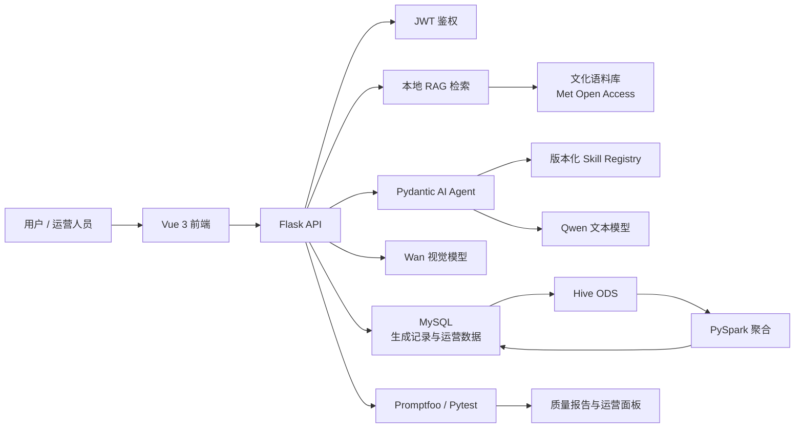

# 智能文创平台 · Smart Cultural Platform

> 面向文化创意产品生成、可信知识检索、质量评测与运营分析的一体化全栈 AI 应用。

智能文创平台以“文化知识可追溯、生成结果可评测、运行过程可审计”为核心目标，提供从文化素材检索、结构化文创方案生成、视觉生成，到质量评测与运营数据分析的完整应用链路。

项目采用前后端分离架构，结合本地 RAG、模型工具调用、版本化 Skill、自动化测试和数据治理能力，适用于博物馆文创、文化 IP 衍生品、数字展陈与内容创作等场景。

## 核心能力

### 文化文创生成

- 支持根据用户需求生成结构化文创产品方案，包括产品定位、文化灵感、材质工艺、设计语言、使用场景与传播建议。
- 支持文本生成与文创视觉生成协同，形成从创意 Brief 到展示素材的生成链路。
- 使用结构化输出约束，降低自由文本结果在字段完整性和格式一致性上的不确定性。
- 对生成过程进行记录与追踪，便于后续质量分析、问题定位和运营统计。

### 可信文化知识检索（RAG）

- 基于本地文化语料构建检索增强生成链路，当前使用 Met Open Access 文化藏品数据作为可追溯知识来源。
- 使用 `jieba` 中文分词与 BM25 检索，为生成任务提供相关文化证据。
- 对引用来源进行约束校验，确保最终结果中的来源标识来自实际检索证据子集。
- 将文化事实、创意推演与模型生成结果分层处理，增强内容的可解释性与可审计性。

### 版本化 Agent Skill 路由

- 基于 Pydantic AI 构建 Agent 任务路由能力。
- 通过固定 Registry 管理版本化 Skill 资产，统一校验名称、类型、版本、描述、许可证与来源信息。
- 内置文创产品文案与视觉设计规范等专业 Skill，可根据任务选择并加载对应规则。
- 支持文化证据检索、Skill 加载、结构化输出等受控工具链路。
- 对路径穿越、符号链接、损坏 Frontmatter、非法编码、元数据漂移等资产异常建立稳定错误边界。

### 质量评测与安全测试

- 使用 Promptfoo 构建 Agent、Stub 与安全测试集，覆盖结构化输出、工具调用、错误处理、提示注入防护等场景。
- 支持离线可重复的模型契约测试，避免测试过程依赖真实模型调用。
- 支持质量报告的脱敏展示与运营端查看，帮助定位评测失败原因和模型输出风险。
- 覆盖故意失败退出码验证，确保评测门禁本身具备可信度。

### 运营与数据分析

- 在线业务侧以 MySQL 的 `generation_logs` 为生成记录事实来源，保存生成任务、结果与质量相关数据。
- 通过 SQLAlchemy 与 Alembic 管理数据库模型和迁移版本，保障数据结构可演进。
- 已打通 `MySQL → Hive ODS → PySpark 聚合 → MySQL 运营查询` 数据链路，并配套数据契约、质量校验与查询能力。
- Spark/Hive 运营分析面板当前按数据集接入策略默认关闭；后续将基于适配的数据集扩展运营指标与可视化分析能力。

## 系统架构



## 技术栈

| 领域 | 技术与组件 |
| --- | --- |
| 前端 | Vue 3、Vite、Axios、Chart.js、Playwright |
| 后端 | Python、Flask、Flask-CORS、Pydantic |
| AI 应用 | Pydantic AI、OpenAI 兼容接口、DashScope、Qwen、Wan |
| RAG 与文本处理 | BM25、rank-bm25、jieba、本地文化语料、来源引用约束 |
| 数据库与迁移 | MySQL、SQLAlchemy、Alembic、PyMySQL |
| 大数据链路 | Hive、HDFS、PyHive、PySpark、Pandas |
| 测试与评测 | Pytest、Promptfoo、Testcontainers、Playwright |
| 工程质量 | 环境变量配置、JWT、结构化日志、超时控制、错误码边界、敏感信息扫描 |

## 工程设计

### 结构化契约

- 使用 Pydantic 定义输入、输出、Agent 路由和质量报告的数据结构。
- 对生成结果、引用来源、Skill 元数据和错误状态建立明确契约。
- 通过数据库迁移与数据契约控制数据结构演进。

### 可审计生成

- 每次生成任务均可关联文化检索证据、使用的 Skill、模型输出与质量评测结果。
- Skill 资产采用版本化 Registry 管理，支持来源、许可证和版本一致性校验。
- 对模型、工具、资产和输出之间的边界进行显式约束，提升问题定位效率。

### 分层测试体系

- 单元测试覆盖业务逻辑、RAG、Agent 路由、Skill 资产校验与 API 错误边界。
- 集成测试通过 Testcontainers 验证 MySQL 与 Alembic 迁移链路。
- Promptfoo 评测覆盖 Agent 行为、离线 Stub、提示注入与安全约束。
- Playwright 覆盖前端核心流程与质量报告展示。
- 前端构建、依赖一致性检查与差异检查可作为提交前门禁。

## 项目结构

```text
smart-cultural-platform/
├── backend/                 # Flask API、Agent、RAG、数据库与测试
│   ├── agents/              # Pydantic AI 路由、Skill Registry 与 Skill 资产
│   ├── migrations/          # Alembic 数据库迁移
│   ├── services/            # 生成、检索、数据服务
│   └── tests/               # 单元、契约、集成测试
├── frontend/                # Vue 3 管理端与用户端页面
│   ├── src/                 # 页面、组件、接口与图表
│   └── tests/e2e/           # Playwright 端到端测试
├── evaluation/              # Promptfoo 评测、Provider 与质量报告
├── rag/                     # 本地文化语料与检索索引
├── scripts/                 # 数据同步、质量检查与辅助脚本
└── docs/                    # 架构、数据契约与工程文档
```

## 本地启动

### 1. 后端环境

```bash
cd backend
python -m venv .venv
```

激活虚拟环境后安装依赖：

```bash
pip install -r requirements.txt
```

配置 `backend/.env` 中的模型、数据库与 JWT 相关环境变量后启动服务：

```bash
python app.py
```

### 2. 前端环境

```bash
cd frontend
npm ci
npm run dev
```

默认情况下：

- 前端开发服务运行于 `http://localhost:3000`
- 后端 API 服务运行于 `http://localhost:5000`

## 质量验证

```bash
# 后端测试
pytest backend/tests -q

# 前端构建
cd frontend
npm run build

# 前端端到端测试
npm run test:e2e

# Promptfoo 离线评测
cd ../evaluation/promptfoo
npm ci
npm run eval:agent
npm run eval:stub
npm run eval:security
```

## 功能演示

[](docs/demo/smart-cultural-platform-demo-1440p.webm)

演示包含完整三视图 Brief、真实文化证据检索、Pydantic AI Agent 原生 Skill 调用、文本生成、一次 MySQL 事务写入及运营报告回看。录像展示的业务生成使用真实 Qwen 文本调用；图片模型调用为 0，DeepSeek Judge 不属于本次演示，文本 Skill 业务链路仍标注为 experimental。

仓库同时提供可复录的 Ubuntu Playwright 脚本：
[`frontend/tests/demo/record-business-demo.spec.js`](frontend/tests/demo/record-business-demo.spec.js)。录制前需保持 Flask 与 Vite 服务运行，并通过环境变量提供运营账户；完整命令见
[`frontend/tests/demo/README.md`](frontend/tests/demo/README.md)。

## 数据与模型边界

- 文化知识检索基于本地冻结语料执行，避免在线来源变化影响测试可复现性。
- 文本与视觉模型均通过环境变量配置，不在代码库中保存密钥。
- 质量评测报告默认进行敏感信息脱敏处理。
- 大数据运营链路与在线生成链路解耦，可根据数据集接入策略独立启用。

## 后续演进

- 扩展适配的文化数据集与行业数据集。
- 丰富 Spark/Hive 运营分析指标与可视化面板。
- 持续完善真实模型质量评测、A/B 对比与人工反馈闭环。
- 扩展更多文化创意品类、设计规范与版本化 Skill。

---
如对项目感兴趣，欢迎通过 GitHub Issue 或 Pull Request 交流。
