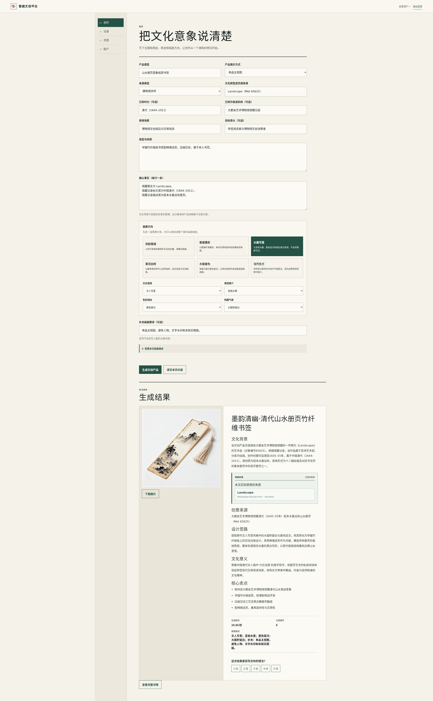
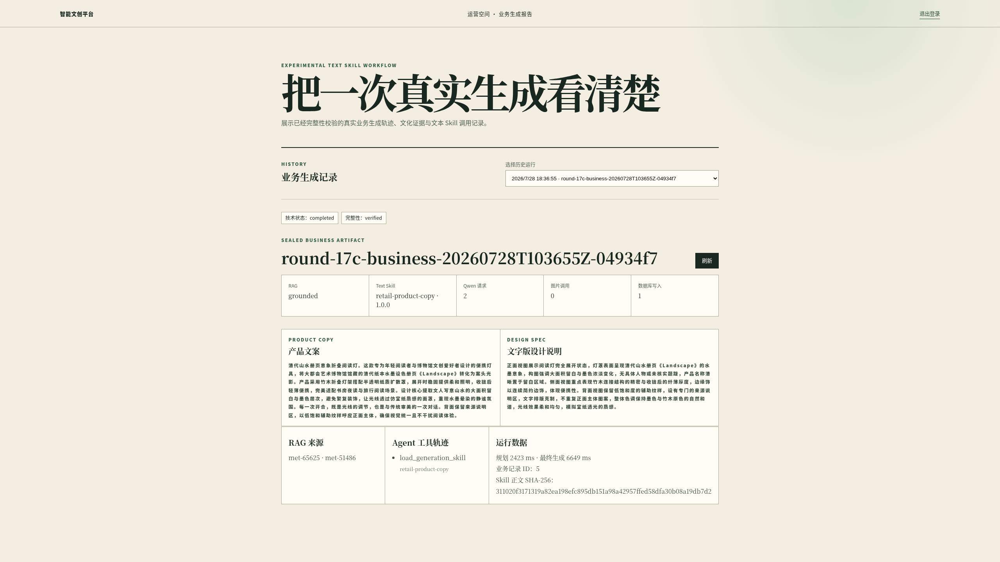
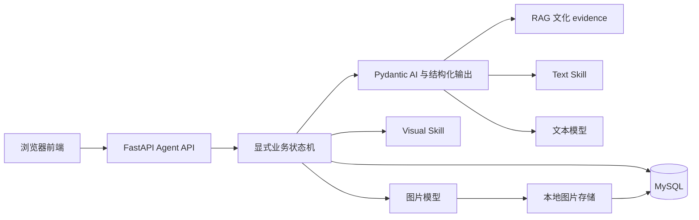
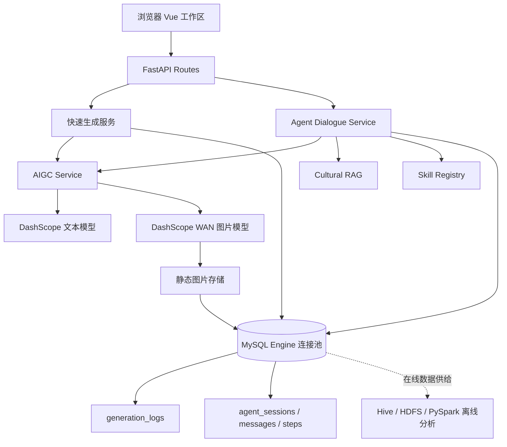

# Smart Cultural Platform

一个面向文化创意产品设计的 AI 平台，支持结构化快速生成和多轮协作式设计。系统将文化资料检索、文本与视觉 Skill、结构化模型输出、用户确认和图片生成整合为可恢复的完整设计流程。

平台面向博物馆文创、文化 IP 衍生品、数字展陈与文化内容创作等场景。后端使用 FastAPI，在线生成结果以 MySQL `generation_logs` 为事实来源；协作式设计以独立持久会话和受控状态机组织，而不是通用自由聊天。

## 项目预览

[](docs/demo/smart-cultural-platform-user-image-demo.webm)

普通用户工作区展示结构化快速生成、结果查看与创作记录。

[](docs/demo/smart-cultural-platform-demo-1440p.webm)

文本 Skill 工作流展示文化 evidence、受控 Skill 加载与结构化文本交付。协作式设计入口位于同一创作工作区，可在快速生成与协作式设计之间切换。

## 核心能力

### 快速生成

- 使用结构化文化来源、产品需求、材质、场景和展示方式创建文创产品 Brief。
- 使用本地文化语料 RAG 增强可追溯的文化资料；资料不足时保留明确的 evidence 状态。
- 调用文本模型生成产品文案与设计内容，并调用图片模型生成产品图；生成图片保存到本地静态存储。
- 以 `Idempotency-Key` 和 `generation_attempts` 防止同一生成请求重复执行。
- 将最终结果写入 `generation_logs`，提供历史、详情、评分与下载。

### 协作式设计 Agent

协作式设计围绕文创产品生成任务工作，而非支持任意闲聊：

```text
自然语言需求
→ BriefProposal
→ 用户确认或修改需求
→ RAG 检索
→ Text Skill 选择
→ ProductDesignDraft
→ 最多四次产品设计文本修订
→ 用户确认文字稿
→ Visual Skill 选择
→ ImagePromptPackage
→ 用户确认图片生成
→ 图片生成、持久化和历史恢复
```

- 关键节点由用户确认：Brief、产品设计文字稿和最终图片生成分别受确认门禁控制。
- 每个 session 独立且 owner-scoped；刷新后可通过 `agent_session_id` 恢复当前会话。
- `client_turn_id` 和 `decision_id` 保证消息与确认动作幂等；重复图片确认不会生成第二张最终图片。
- 已完成对话会进入历史记录，并以只读会话页面回顾；用户可随时开始新的独立协作式设计。

## Agent 运行机制



- **显式状态机**负责阶段流转、四次文本修订限制、幂等、owner scope 与用户确认门禁。模型不能自行跨越业务阶段。
- **Pydantic AI**用于受限阶段的结构化理解和产品文本输出；项目同时复用现有 OpenAI-compatible AIGC 客户端以适配配置的模型服务。
- **RAG**提供文化资料依据；没有可靠命中时以 `creative_only` 降级，避免将模型联想包装成历史事实。
- **Text Skill**约束产品设计稿表达；**Visual Skill**约束视觉提示词的产品呈现方式。
- 用户负责确认 Brief、文字稿与图片生成，后端只在对应状态下执行受控领域服务。

## Session、Context 与持久化

协作式设计使用 Alembic 增量迁移创建以下会话数据：

- `agent_sessions`：保存当前状态、当前 Brief、确认的产品文字稿、视觉提示词包、修订次数、错误摘要与最终 `generation_logs` 关联。
- `agent_messages`：保存用户和助手可展示消息，不保存模型隐藏思维链或 provider 原始 payload。
- `agent_steps`：保存执行阶段、Skill、工具结果摘要、错误摘要和耗时，供前端时间线与故障恢复使用。

当前上下文只使用同一 session 的规范化状态、已确认 Brief、当前设计稿、最新用户反馈和精简 evidence。平台不实现跨 session 的长期偏好记忆，也不将完整 trace、全部历史版本或完整 RAG 语料反复发送给模型。

## 领域能力与受控工具

以下能力以领域服务或工具形式存在，并由业务状态机编排；模型不能任意调用未注册能力：

- `retrieve_cultural_evidence`
- `load_text_skill`
- `generate_product_text`
- `load_visual_skill`
- `build_visual_prompt`
- `generate_product_image`
- `save_generation_result`

文本 Skill 和视觉 Skill 均来自固定 Registry，并通过安全 loader 校验 `kind`、版本、元数据和资产内容。视觉提示词包由确认的 Brief、产品设计稿、精简 evidence、视觉 Skill 和固定负向约束构造；它不会退回为仅使用初始风格和产品名的提示词。

## 技术架构

| 层级 | 实际组件与职责 |
| --- | --- |
| 前端 | Vue 3、Vite、Axios、Chart.js；协作面板、会话时间线、确认卡与 API adapter。 |
| 后端 | FastAPI、Pydantic、Pydantic AI、PyJWT；路由层与领域服务分离。 |
| 数据访问 | PyMySQL、SQLAlchemy Engine 连接池、Alembic 增量迁移。 |
| 模型服务 | DashScope 的 OpenAI-compatible 文本接口；DashScope WAN 文生图/参考图编辑接口，经 `AIGCService` 适配。 |
| RAG 与 Skill | 本地文化语料、BM25、`rank-bm25`、`jieba`；固定版本的 Text / Visual Skill Registry。 |
| 数据与离线分析 | MySQL 在线生成日志；Hive、HDFS、PyHive、PySpark 和 Pandas 用于仓库中的离线数据处理与分析链路。 |
| 前端验证 | Playwright 端到端测试与 Vite 构建。 |

## 系统架构图



## 关键可靠性设计

- 快速生成使用 `Idempotency-Key` 与 `generation_attempts` 追踪同一请求的执行结果。
- 协作式设计以 `client_turn_id`、`decision_id`、数据库唯一约束和版本字段控制重复消息、重复确认与并发冲突。
- 所有 Agent session 均以 JWT 认证用户为 owner；非 owner 查询不会暴露会话存在性。
- SQLAlchemy Engine 在单个 API 进程中复用 PyMySQL 连接；数据库事务保持短小，模型与图片 provider 调用不放进长事务。
- Alembic 按增量迁移演进结构；`0006` 引入生成幂等追踪，`0007` 引入 Agent 会话表。
- 图片确认只在 `waiting_image_confirmation` 状态开放；最终图片、`generation_logs`、session 关联和完成状态在短事务中落库。
- API 使用稳定 DTO projection，而不是将数据库行或 JSON 列直接透传前端；字段不完整时前端显示“结果暂时无法展示”，不误报为模型生成失败。
- 失败步骤及已完成内容会被保留，刷新后可恢复并继续查看可展示的会话状态。

## 目录结构

```text
smart-cultural-platform/
├── backend/
│   ├── routes/                 # FastAPI 路由
│   ├── domain/                 # Pydantic 领域模型与状态机
│   ├── services/               # 生成、会话、持久化与图片存储服务
│   ├── agents/                 # Skill Registry 与 Skill 资产
│   ├── rag/                    # 本地文化资料检索
│   ├── migrations/versions/    # Alembic 增量迁移
│   └── tests/                  # 后端与 Agent 聚焦测试
├── frontend/
│   ├── src/components/         # 工作区、Agent 面板与详情组件
│   ├── src/services/           # 前端 API adapter
│   └── tests/e2e/              # Playwright 测试
├── scripts/                    # 数据初始化与离线辅助脚本
├── docs/                       # 设计文档与演示素材
└── alembic.ini
```

## 快速开始

### 环境要求

- Python 3.10+（代码使用现代类型标注与 Pydantic v2 API）。
- Node.js 18+（建议版本；前端使用 Vite 4 和 Vue 3）。
- 可访问的 MySQL 服务；若使用真实生成，还需要有效的 DashScope 配置。

### 安装依赖

在仓库根目录执行：

```bash
# 后端
python3 -m venv backend/.venv
source backend/.venv/bin/activate
python -m pip install -r backend/requirements.txt

# 前端
cd frontend
npm ci
cd ..
```

### 配置环境变量

从 `backend/.env.example` 创建本地 `backend/.env`，仅在本机保存配置。不要提交该文件。

| 变量 | 用途 |
| --- | --- |
| `JWT_SECRET`、`JWT_ALGORITHM` | JWT 鉴权配置。 |
| `DASHSCOPE_API_KEY` | DashScope 模型服务认证。 |
| `DASHSCOPE_OPENAI_BASE_URL`、`DASHSCOPE_API_BASE_URL` | 文本与图片服务地址。 |
| `DASHSCOPE_TEXT_MODEL`、`DASHSCOPE_IMAGE_MODEL`、`DASHSCOPE_IMAGE_EDIT_MODEL`、`DASHSCOPE_IMAGE_SIZE` | 文本、文生图、编辑模型与图片尺寸。 |
| `DASHSCOPE_TEXT_CONNECT_TIMEOUT_SECONDS`、`DASHSCOPE_TEXT_READ_TIMEOUT_SECONDS`、`DASHSCOPE_IMAGE_CONNECT_TIMEOUT_SECONDS`、`DASHSCOPE_IMAGE_READ_TIMEOUT_SECONDS` | 模型调用超时控制。 |
| `MYSQL_HOST`、`MYSQL_PORT`、`MYSQL_USER`、`MYSQL_PASSWORD`、`MYSQL_DATABASE` | MySQL 连接配置。 |
| `MYSQL_CONNECT_TIMEOUT_SECONDS`、`MYSQL_READ_TIMEOUT_SECONDS`、`MYSQL_WRITE_TIMEOUT_SECONDS` | MySQL 网络超时。 |
| `MYSQL_POOL_SIZE`、`MYSQL_POOL_MAX_OVERFLOW`、`MYSQL_POOL_TIMEOUT_SECONDS`、`MYSQL_POOL_RECYCLE_SECONDS` | SQLAlchemy Engine 连接池配置。 |
| `HIVE_HOST`、`HIVE_PORT`、`HIVE_USERNAME`、`HIVE_DATABASE` | 可选离线 Hive 链路配置。 |
| `RUN_REAL_BUSINESS_SMOKE`、`SMOKE_TEST_USERNAME`、`SMOKE_TEST_PASSWORD` | 受控真实业务冒烟开关与测试身份。 |
| `ADMIN_CREATION_KEY` | 管理员创建相关的本地配置。 |

### 数据库迁移

仓库当前 Alembic head 为 `0007`。执行迁移前请确认环境变量指向目标开发数据库：

```bash
backend/.venv/bin/alembic -c alembic.ini current
backend/.venv/bin/alembic -c alembic.ini upgrade head
```

### 启动服务

```bash
# 终端一：FastAPI 后端（仓库根目录）
PYTHONPATH=. backend/.venv/bin/uvicorn backend.app:app --host 0.0.0.0 --port 5000 --reload

# 终端二：Vue 前端
cd frontend
npm run dev -- --host 0.0.0.0 --port 3000 --strictPort
```

浏览器访问 `http://127.0.0.1:3000/index.html`；健康检查为 `http://127.0.0.1:5000/api/health`。

## 测试

按改动范围选择测试；mock/stub 测试与真实模型冒烟应分开执行和报告。

```bash
# 后端完整测试
backend/.venv/bin/python -m pytest backend/tests -q

# 协作式设计聚焦测试
backend/.venv/bin/python -m pytest \
  backend/tests/test_agent_brief_agent.py \
  backend/tests/test_agent_dialogue_repository.py \
  backend/tests/test_agent_dialogue_routes.py \
  backend/tests/test_agent_dialogue_service.py \
  backend/tests/test_agent_product_text.py \
  backend/tests/test_agent_visual_prompt.py \
  backend/tests/test_agent_image_generation.py -q

# 前端构建与端到端测试
cd frontend
npm run build
npm run test:e2e
```

真实模型冒烟依赖有效环境变量、目标数据库与显式授权；它不应被 mock 测试替代，也不应在未授权时自动执行。

## 演示流程

以这句需求开始：

> 以三兔共耳纹样设计一款现代桌面灯，强调环形动态感，避免仿古造型。

1. 在“协作式设计”中输入需求，Agent 生成面向用户的 Brief 理解。
2. 确认 Brief，或用自然语言局部修改、要求全部重新理解。
3. 系统检索文化资料，选择 Text Skill，生成产品设计稿。
4. 提出一次设计修改，例如调整材质或配色；成功修订最多可进行四次。
5. 确认设计稿，系统选择 Visual Skill 并生成可读的视觉方向。
6. 确认图片生成，系统保存图片、最终日志和 session 关联。
7. 在创作记录中以只读方式回顾完整对话、步骤、设计文本、视觉方向和最终结果。

## 当前范围

- 支持文创产品设计任务范围内的协作式对话。
- 产品设计文本最多成功修订四次；每个 session 只允许一次最终图片确认生成。
- 不支持图片生成后的继续修改、编辑或重绘。
- 不支持跨 session 长期记忆、通用自由聊天、多 Agent 或 MCP。
- 真实文本与图片生成依赖有效的本地环境配置和可用模型服务。
